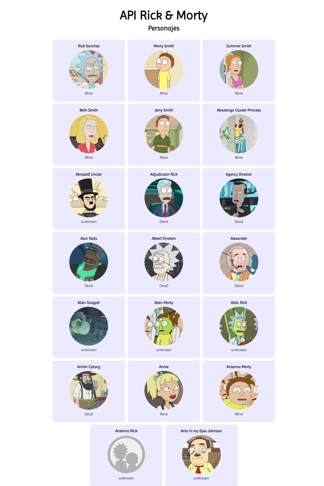

# Práctica: consumir API con javascript

### Descripción:

Práctica de consumo de API pública rick and morty obteniendo y mostrando datos en pantalla para reforzar conocimientos de HTML, CSS y JavaScript.

**Vista previa del proyecto:**

**Visualización de datos en pantalla:**

### Recursos
* Fuente en [Google Fonts](https://fonts.google.com/)
* API en [The rick and morty API](https://rickandmortyapi.com/)
* Colores en [color hunt](https://colorhunt.co/)
